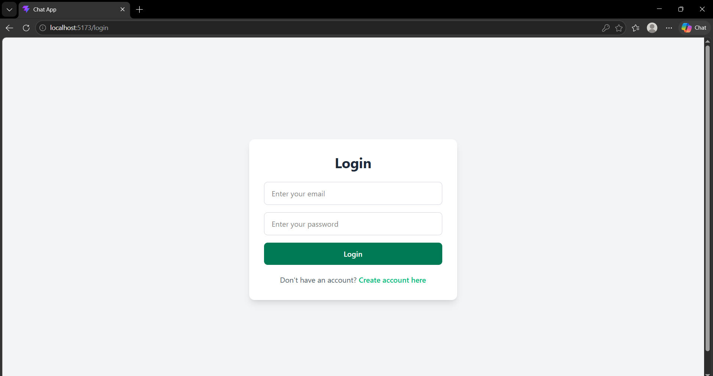
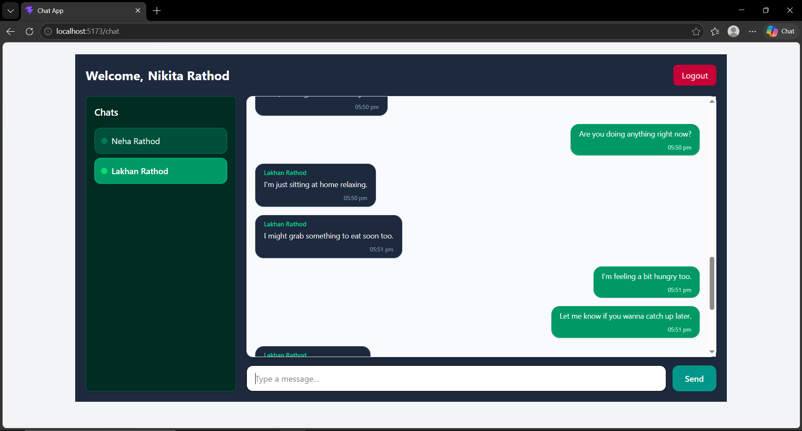

# 💬 Real-Time Chat Application (MERN + Socket.IO)

A full-stack real-time chat application built using the MERN stack with Socket.IO for instant messaging, online user tracking, and private conversations.

---

## Features

- User Authentication (Register / Login)
- One-to-one private messaging
- Real-time messaging using Socket.IO
- Online users indicator
- Typing indicator
- Date Indicator
- Message timestamps
- Responsive UI (mobile + desktop)
- Conversation management
- Auto message sync across tabs

---

## Tech Stack

### Frontend
- React.js
- Context API
- Tailwind CSS
- Socket.IO Client
- Axios
- React Router

### Backend
- Node.js
- Express.js
- MongoDB + Mongoose
- Socket.IO
- JWT Authentication

---


## Installation & Setup

### 1. Clone repository
```bash
git clone https://github.com/your-username/chat-app.git
```

---

### 2. Install dependencies
#### Backend
```bash
cd server
npm install
```
#### Frontend
```bash
cd client
npm install
```

---

### 3. Setup environment variables
#### Create .env file in server folder:
```bash
PORT=4000
MONGO_URI=your_mongodb_connection
JWT_SECRET=your_secret_key
```

#### Create .env file in client folder:
```bash
VITE_API_BASE_URL=your_base_api_url

VITE_BACKEND_URL=your_backend_url
```

---

### 4. Run project
#### Start Backend
```bash
cd server
npm run server
```

#### Start Frontend
```bash
cd client
npm run dev
```

---

## Socket Events

### Client → Server
- `join-chat`
- `private-message`
- `typing`
- `stop-typing`

### Server → Client
- `online-users`
- `receive-private-message`
- `user-typing`
- `user-stop-typing`

---

## Screenshots

### Login Page


### Chat Page


---

## Future Improvements

- Read receipts (seen/delivered)
- Group chats
- Image/file sharing
- Change theme
- Message search
- Notifications system

---

## Author
Developed by Nikita Rathod.

---